# Blood Recruit

Welcome to Blood Recruit, a project developed during the Prajwalan Hackathon 2023. This application aims to simplify the process of finding and recruiting blood donors through an intuitive and user-friendly platform.

## Table of Contents

- [About](#about)
- [Features](#features)
- [Tech Stack](#tech-stack)
- [Installation](#installation)
- [Usage](#usage)
- [Twilio Integration](#twilio-integration)
- [Screenshots](#screenshots)
- [Contributing](#contributing)
- [License](#license)
- [Acknowledgements](#acknowledgements)

## About

Blood Recruit is designed to connect blood donors with recipients quickly and efficiently. By leveraging modern web technologies, the platform allows users to register as donors, request blood, and seperate dashboard access to blood banks.

## Features

- **Dashboard for Blood Banks:** A comprehensive dashboard for blood banks to manage requests and availability district-wise, and city/town-wise.
- **User Registration:** Users can register as blood donors.
- **Blood Request:** Users can request specific blood types.
- **Notifications:** Users receive notifications about request statuses and donor matches.
- **SMS Alerts:** Integrated with Twilio to send SMS notifications for critical updates.


## Tech Stack

- **Frontend:** HTML, CSS, JavaScript
- **Backend:** PHP
- **Database:** MySQL
- **SMS Alerts:** Twilio SDK

## Installation

1. **Clone the repository:**

    ```bash
    git clone https://github.com/HarshaSai007/Blood_Recurit.git
    cd Blood_Recurit
    ```

2. **Set up the database:**


3. **Install Twilio SDK:**

    ```bash
    composer require twilio/sdk
    ```

4. **Run the application:**

    - Deploy the application on a local server (e.g., XAMPP, WAMP) and navigate to `http://localhost/Blood_Recurit` in your browser.

## Usage

- **Register:** Sign up with your details.
- **Login:** Log in to your account.
- **Request Blood:** Request a specific blood type if you are a recipient.
- **Dashboard for Blood Banks:** Manage blood requests and availability district-wise and city/town-wise through a dedicated dashboard.

## Twilio Integration

To integrate Twilio for sending SMS notifications, follow these steps:

1. **Sign up for a Twilio account:** [Twilio Signup](https://www.twilio.com/try-twilio)
2. **Get your Twilio credentials:** Account SID, Auth Token, and a Twilio phone number.
3. **Update `.env` file:** Add your Twilio credentials.

    ```env
    TWILIO_SID=your_account_sid
    TWILIO_AUTH_TOKEN=your_auth_token
    TWILIO_PHONE_NUMBER=your_twilio_phone_number
    ```


## Screenshots

Here are some screenshots of the Blood Recruit application:

### User Screenshots

1. **Register Page:**
    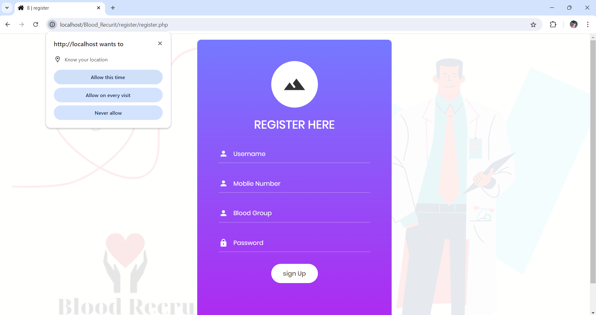

2. **Login Page:**
    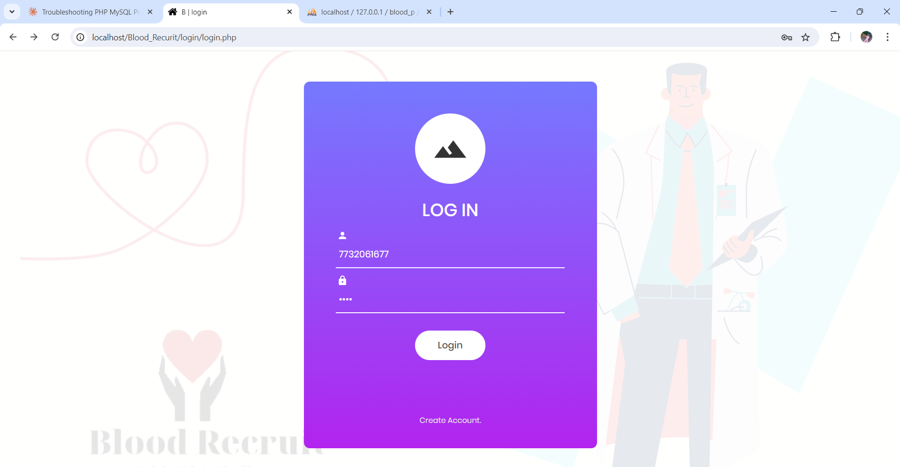

3. **Home Page:**
    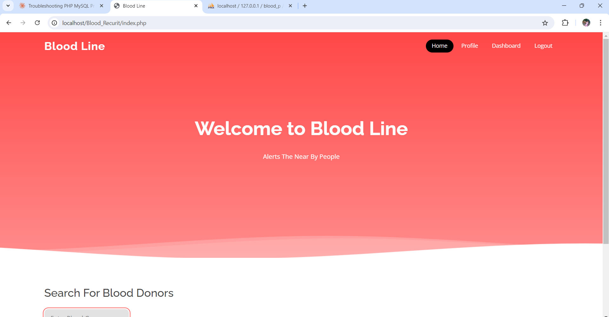

4. **Home Page 2:**
    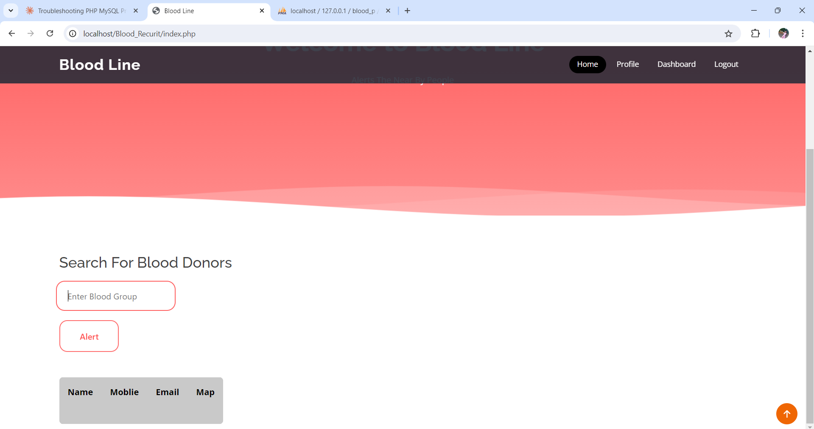

### Blood Bank Screenshots

1. **Donor Page:**
    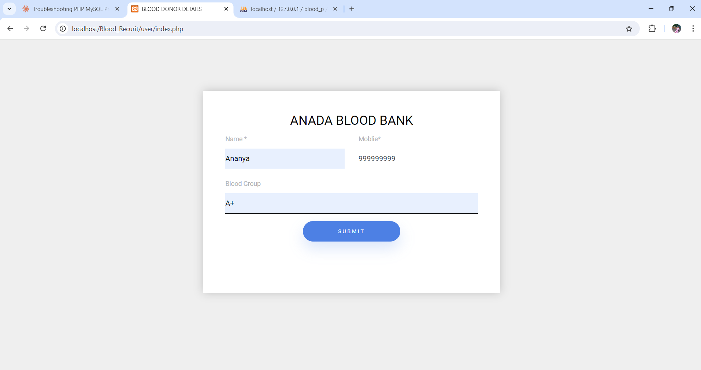

2. **Dashboard 1:**
    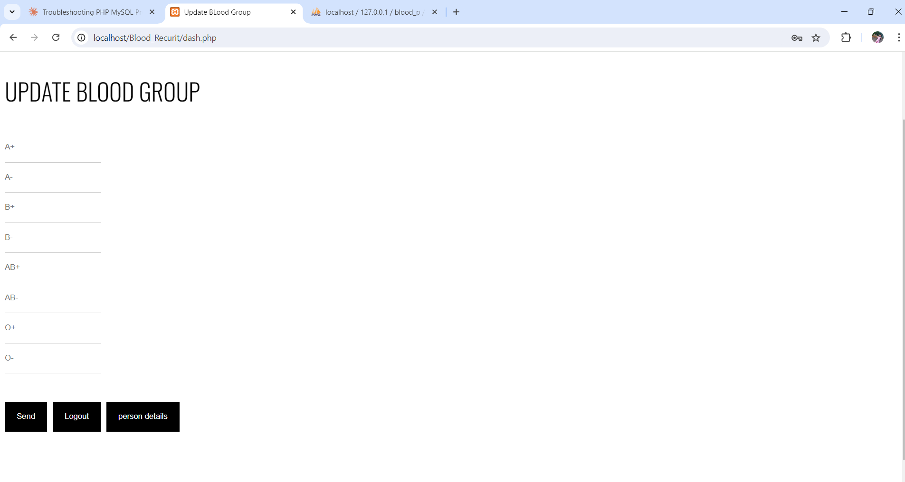

3. **District Page:**
    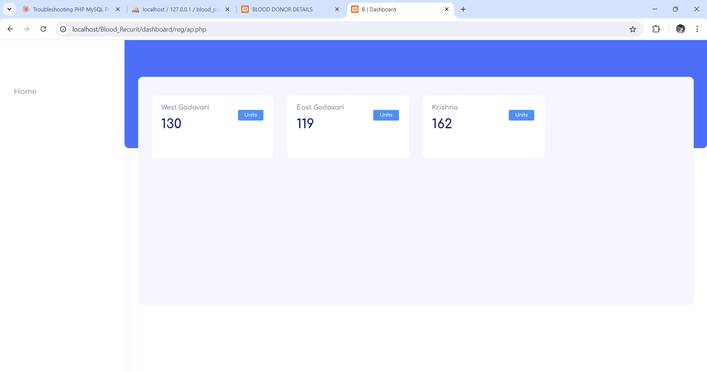

4. **City Page 1:**
    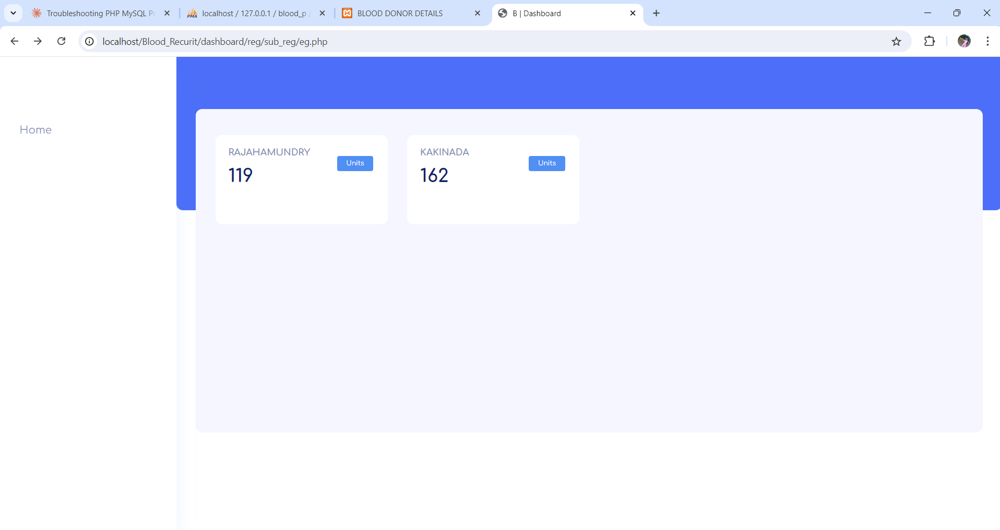

5. **City Page 2:**
    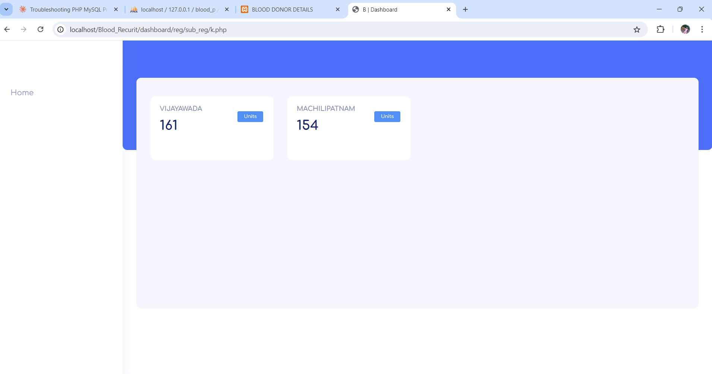

6. **City Page 3:**
    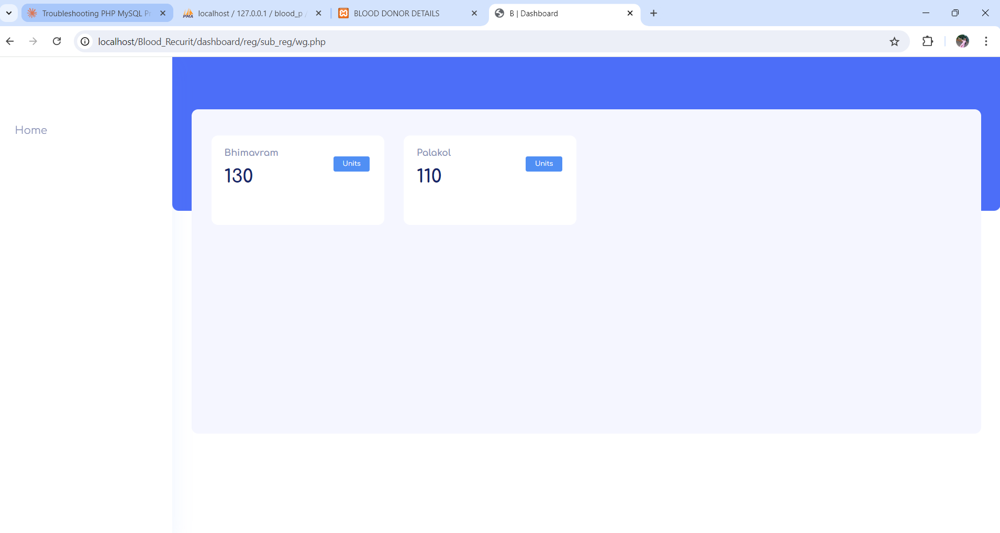

7. **Person Details Page:**
    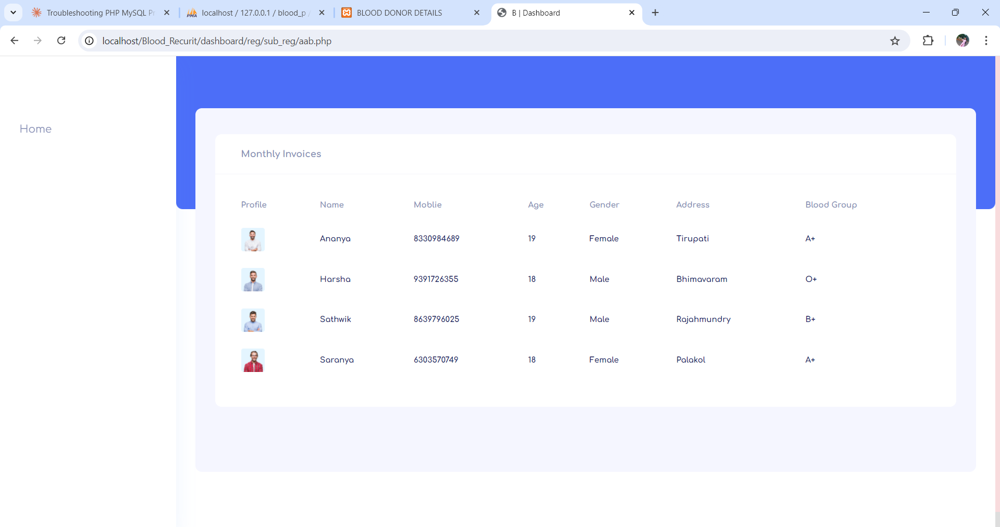


## License

This project is licensed under the MIT License. See the [LICENSE](LICENSE) file for details.

## Acknowledgements
- All the team members and contributors who made this project possible.

---

